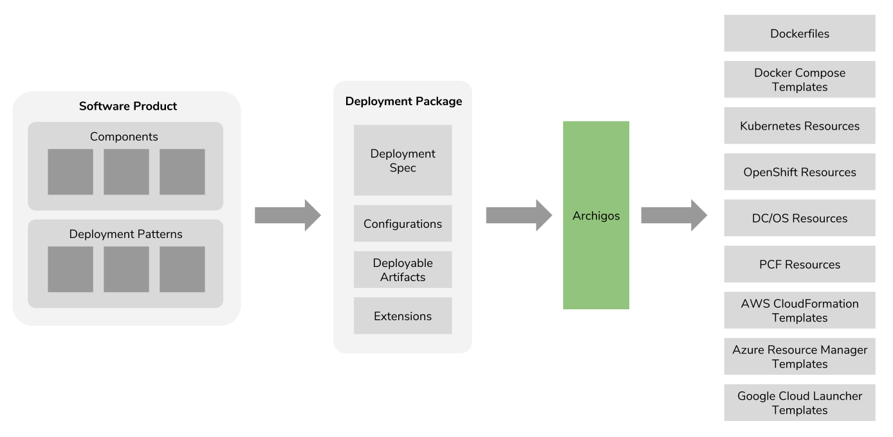

# Archigos



Archigos (Greek for 'Chief') is an infrastructure resource generator. It makes use of a deployment specification 
for defining the deployment architecture of any software system and generating resources required for deploying 
the given software system on Docker, Docker Compose, Kubernetes, OpenShift, Pivotal Cloud Foundry, DC/OS, AWS, 
Azure and Google Cloud.

## Getting Started

Follow below steps to get started with Archigos:

1. Install the [Go tools](https://golang.org/doc/install) by following the official installation guide.

2. Clone this repository:
   
   ```
   git clone https://github.com/imesh/archigos
   ```

3. Build the source code:

   ````bash
   cd archigos
   go build
   ````

4. Run the binary:

   ```bash
   ./archigos
   ```

5. Switch to the output folder and view the generated files:

   ```bash
   cd output/
   output$ tree
    .
    └── docker
        ├── wso2am
        │   └── Dockerfile
        └── wso2am-analytics
            └── Dockerfile
   ```

## Deployment Specification

The archigos deployment specification has been designed according to standards and guidelines used by Docker, Docker Compose, Kubernetes, DC/OS, AWS Cloud Formation to be able to provide a generic definition for any software deployment:

````yaml
specVersion: 0.1
kind: Deployment
name: Name of the deployment
version: Version of the deployment
components:  # List of components
-
  name: Name of the component
  codeName: Code name of the component
  version: Version of the component
  cpu: Number of CPUs required
  memory: Amount of memory required 
  disk: Amount of disk space required
  distribution: Distribution file name
  entrypoint: Startup script
  replicas: Number of replicas
  scalable: Scalable or not
  clustering: Clustering needed or not
  ports:
  -
    name: Port name
    protocol: Protocol of the port
    port: Port number exposed
    external: Port need to be exposed externally or not
    sessionAffinity: Session affinity required or not
  databases:
  -
    name: Database name
    createScript: Path of the database creation script
  dependencies:
  -
    component: Dependent component code name
    ports:
    - Name of the dependent component port used
  livenessProbe:
    # Define either httpGet or tcpSocket
    httpGet: # HTTP liveness probe
      path: Context path of the HTTP endpoint
      port: Port of the HTTP endpoint
    tcpSocket: # TCP liveness probe
      port: TCP port to be used by the probe
    initialDelaySeconds: Initial delay in seconds
    periodSeconds: Period in seconds
````
